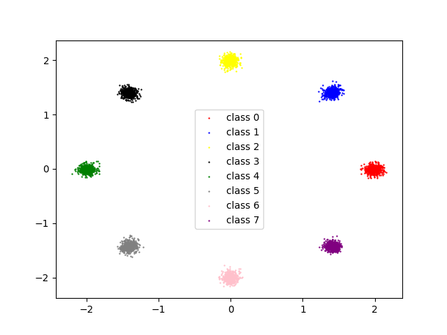
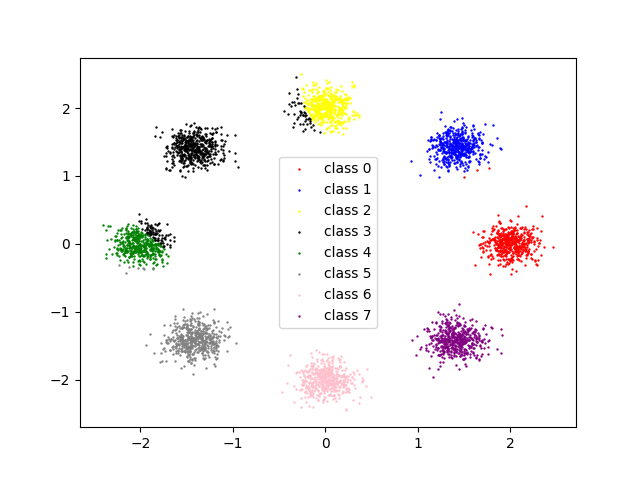
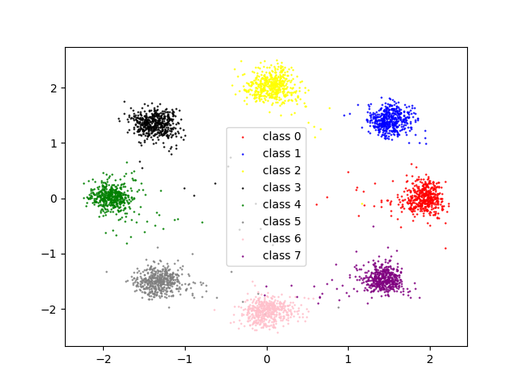

# FeatureLearningRep

Simple replication of some feature learning papers.

1. cvae.py - [Conditional VAE](https://proceedings.neurips.cc/paper/2015/file/8d55a249e6baa5c06772297520da2051-Paper.pdf)

Sohn, Kihyuk, Honglak Lee, and Xinchen Yan. "Learning structured output representation using deep conditional generative models." Advances in neural information processing systems 28 (2015).

Generate examples with label

2. INN.py - [Invertible Neural Network](https://arxiv.org/pdf/1808.04730.pdf)

Ardizzone, Lynton, et al. "Analyzing inverse problems with invertible neural networks." arXiv preprint arXiv:1808.04730 (2018).

****(I didn't train for enough epochs and the model performance was quite unstable.)****

Forward (the point position -> label)

Backward (label -> the point position)

3. towards_kmeans_friendly.py - [Towards k-means-friendly spaces](http://proceedings.mlr.press/v70/yang17b/yang17b.pdf)

Yang, Bo, et al. "Towards k-means-friendly spaces: Simultaneous deep learning and clustering." international conference on machine learning. PMLR, 2017.

Cluster MNIST images without labels

